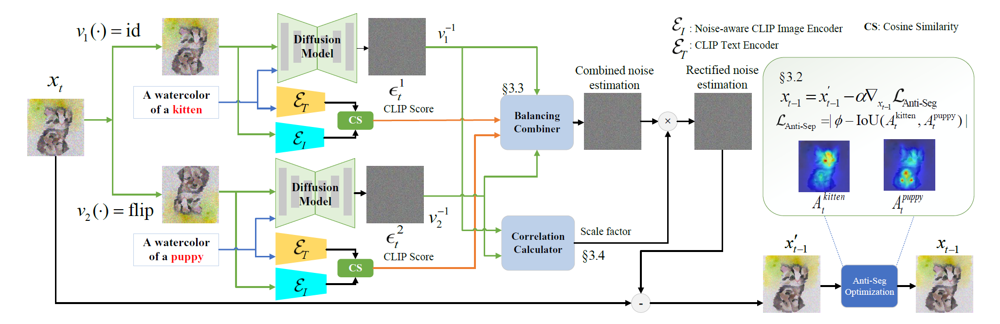

# Anagram-MTL

## About

This repository contains the code for the paper **Diffusion-based Visual Anagram as Multi-task Learning**.

<p align="center">
  
  
  
  
</p>

> Authors: [Zhiyuan Xu\*](https://scholar.google.com/citations?user=oH8rT3AAAAAJ), Yinhe Chen\*, [Huan-ang Gao](https://c7w.tech/about/), Weiyan Zhao, Guiyu Zhang, [Hao Zhao†](https://sites.google.com/view/fromandto)\
> Institute for AI Industry Research (AIR), Tsinghua University

<div align="center">
  
  <a href="https://arxiv.org/abs/2412.02693"></a>
</div>

<br>

*Visual anagrams are images that change appearance upon transformation, like flipping or rotation. With the advent of diffusion models, generating such optical illusions can be achieved by averaging noise across multiple views during the reverse denoising process. However, we observe two critical failure modes in this approach: (i) concept segregation, where concepts in different views are independently generated, which can not be considered a true anagram, and (ii) concept domination, where certain concepts overpower others. In this work, we cast the visual anagram generation problem in a multi-task learning setting, where different viewpoint prompts are analogous to different tasks,and derive denoising trajectories that align well across tasks simultaneously. At the core of our designed framework are two newly introduced techniques, where (i) an anti-segregation optimization strategy that promotes overlap in cross-attention maps between different concepts, and (ii) a noise vector balancing method that adaptively adjusts the influence of different tasks. Additionally, we observe that directly averaging noise predictions yields suboptimal performance because statistical properties may not be preserved, prompting us to derive a noise variance rectification method. Extensive qualitative and quantitative experiments demonstrate our method’s superior ability to generate visual anagrams spanning diverse concepts.*

<br>

<div align="center">
  
</div>

<br>

**Algorithm overview.** During each denoising step, the intermediate image $x_t$ first passes through the diffusion model together with the corresponding text prompt under each view, and also through a noise-aware CLIP model which measures the degree of task completion for each view. **(1) Noise Vector Balancing:** Predicted noise vectors are reweighted based on the degree of task completion before being combined. **(2) Noise Variance Rectification:** Combined noise vectors are rectified by applying a scale factor calculated based on estimated correlation coefficients. **(3) Anti-Segregation Optimization:** The denoised image $x_{t-1}'$ is modulated to encourage intersection of attention maps of different views with an inference-time loss term before being passed to the next denoising step.

## Setup

The code has been tested on Ubuntu 20.04 with CUDA 12.2 and Python 3.9. A single RTX 3090 GPU with 24GB of memory is typically sufficient to run it. For systems with GPUs that have less memory, consider setting `generate_1024` to `False` in `conti_runner.py` to reduce memory requirements.

### Environment

```bash
conda env create -f environment.yml
conda activate anagram-mtl
```

### Pretrained Models

#### DeepFloyd

Our method utilizes [DeepFloyd](https://huggingface.co/DeepFloyd/IF-I-XL-v1.0) as the backbone diffusion model. Follow the instructions on their hugingface page to download the pretrained weights. Please note that a hugingface account is required.

#### Noise-aware CLIP

Our proposed approach also uses a noise-aware CLIP model released by [OpenAI](https://github.com/openai/glide-text2im/blob/main/model-card.md). Open `clip_guided.ipynb` and execute the second, third, and sixth cells to download the model. After downloading, a folder named `glide_model_cache` will be created in the root directory of this repository, containing `clip_image_enc.pt` and `clip_text_enc.pt`.

## Usage

To generate visual anagrams using our method, please refer to the `generate.ipynb` notebook. The notebook primarily calls the `generate_anagram()` function in `conti_runner.py`. 

### Parameters

- `style`: The style of the generated anagram.
- `prompts`: A list of prompts used to generate the anagram.
- `views`: A list of corresponding views for each prompt.
  - Possible views: `identity`, `rotate_cw`, `rotate_ccw`, `flip`, etc.
- `save_dir`: The directory to save the generated anagram.
- `device`: The device to run the code. Default is `cuda`.
- `seed`: The random seed for the sampling process.
- `num_inference_steps`: The number of inference steps for the diffusion model. Default is `30`.
- `guidance_scale`: The strength of Classifier-free Guidance. Default is `10.0`.
- `noise_level`: The noise level for the second stage of the diffusion model. Default is `50`.

Altering arguments with default values should be done with caution, except for `seed`.

### Example

```python
generate_anagram(style='a charcoal drawing of', 
                 prompts=['a leopard', 'a savannah'],
                 views=['identity', 'rotate_cw'],
                 save_dir='output',
                 seed=9)
```


## Citation

If you find this repository helpful, please consider citing our paper:

```bibtex
@misc{xu_diffusion-based_2024,
  title = {Diffusion-based {Visual} {Anagram} as {Multi}-task {Learning}},
  url = {http://arxiv.org/abs/2412.02693},
  doi = {10.48550/arXiv.2412.02693},
  author = {Xu, Zhiyuan and Chen, Yinhe and Gao, Huan-ang and Zhao, Weiyan and Zhang, Guiyu and Zhao, Hao},
  month = dec,
  year = {2024},
  note = {arXiv:2412.02693},
  keywords = {Computer Science - Computer Vision and Pattern Recognition}
}
```

## Acknowledgements

We would like to thank the developers of [DeepFloyd](https://huggingface.co/DeepFloyd/IF-I-XL-v1.0) and [GLIDE](https://github.com/openai/glide-text2im/blob/main/model-card.md) for releasing their pretrained models. We also thank the authors of [Visual Anagrams](https://github.com/dangeng/visual_anagrams) and [Prompt-to-Prompt](https://github.com/google/prompt-to-prompt/) for open-sourcing their codebases, upon which our work is built.